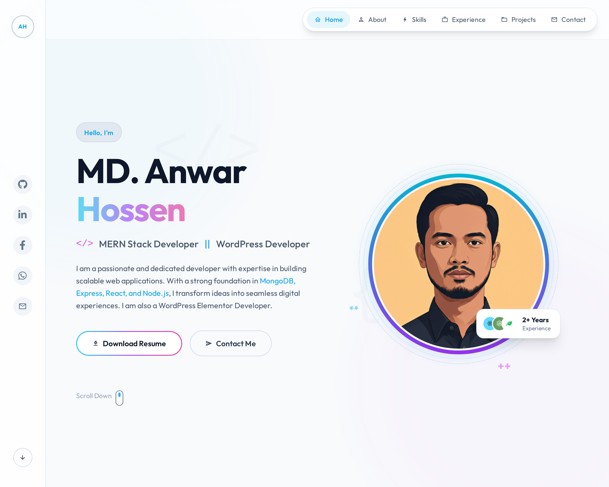

# 🚀 Professional Animated Portfolio - MD. Anwar Hossen

A modern, fully animated React.js portfolio website showcasing professional skills, experience, and projects with smooth animations and interactive elements.



## 🌟 Live Demo

**🔗 Portfolio URL:** `http://localhost:5174/` (Development)
**📱 Responsive:** Works perfectly on all devices

---

## 📋 Project Overview

This is a **professional portfolio website** built with modern web technologies, featuring a comprehensive animation system that creates an engaging and interactive user experience. The portfolio showcases my skills as a **MERN Stack Developer** and **WordPress Developer** with real project examples and professional experience.

### 🎯 Project Goals
- Create a visually stunning and professional online presence
- Showcase technical skills and real-world projects
- Provide an engaging user experience with smooth animations
- Demonstrate proficiency in modern React development
- Ensure accessibility and mobile responsiveness

---

## 🛠️ Tech Stack

### **Frontend Framework**
- **React.js 18.2.0** - Modern React with hooks and functional components
- **Vite 4.4.5** - Fast build tool and development server
- **JavaScript (ES6+)** - Modern JavaScript features

### **Styling & UI**
- **Tailwind CSS 3.3.2** - Utility-first CSS framework
- **PostCSS & Autoprefixer** - CSS processing and vendor prefixes
- **Material Icons** - Google Material Design icons
- **Font Awesome 6.4.0** - Icon library for social media and UI elements
- **Google Fonts (Outfit)** - Modern typography

### **Animation Libraries**
- **Framer Motion 10.18.0** - Declarative animations and gestures
- **GSAP with ScrollTrigger** - High-performance timeline animations
- **React Spring** - Physics-based spring animations

### **Development Tools**
- **ESLint** - Code linting and quality assurance
- **PropTypes** - Runtime type checking for React props
- **Git** - Version control system

---

## ✨ Key Features

### **🎬 Advanced Animation System**
- **Entrance Animations:** Smooth fade-in and slide effects on scroll
- **Interactive Hover Effects:** Scale, lift, and color transitions
- **Continuous Animations:** Floating elements and rotating decorative items
- **Scroll-Triggered Effects:** GSAP ScrollTrigger for reveal animations
- **Physics-Based Movement:** React Spring for natural motion
- **Staggered Animations:** Sequential reveals with perfect timing

### **📱 Responsive Design**
- **Mobile-First Approach:** Optimized for all screen sizes
- **Touch-Friendly Interactions:** Mobile-optimized hover states
- **Flexible Grid Layouts:** CSS Grid and Flexbox for perfect alignment
- **Adaptive Typography:** Responsive text scaling

### **🎨 Modern UI/UX**
- **Dark/Light Mode Toggle:** Seamless theme switching
- **Glassmorphism Effects:** Modern backdrop blur and transparency
- **Gradient Accents:** Beautiful color gradients throughout
- **Smooth Scrolling:** Enhanced navigation experience
- **Loading States:** Interactive feedback for all actions

### **♿ Accessibility Features**
- **Reduced Motion Support:** Respects user preferences
- **Keyboard Navigation:** Full keyboard accessibility
- **Screen Reader Friendly:** Semantic HTML and ARIA labels
- **Focus Management:** Clear focus indicators
- **Color Contrast:** WCAG compliant color schemes

---

## 🏗️ Project Structure

```
portfolio-react/
├── public/
│   ├── favicon.ico          # Website favicon
│   ├── favicon.svg          # SVG favicon
│   ├── profile.jpg          # Profile image
│   └── resume.pdf           # Downloadable resume
├── src/
│   ├── components/          # React components
│   │   ├── AboutSection.jsx     # About me section
│   │   ├── ContactSection.jsx   # Contact form and info
│   │   ├── EducationSection.jsx # Education background
│   │   ├── ErrorBoundary.jsx    # Error handling
│   │   ├── ExperienceSection.jsx # Work experience
│   │   ├── Footer.jsx           # Website footer
│   │   ├── Header.jsx           # Navigation header
│   │   ├── HeroSection.jsx      # Landing section
│   │   ├── ProjectsSection.jsx  # Portfolio projects
│   │   ├── Sidebar.jsx          # Social media sidebar
│   │   └── SkillsSection.jsx    # Technical skills
│   ├── constants/           # Application constants
│   │   └── index.js             # Personal info, projects, skills
│   ├── hooks/               # Custom React hooks
│   │   └── useAnimations.js     # Animation utilities
│   ├── utils/               # Utility functions
│   │   ├── animations.js        # Framer Motion variants
│   │   ├── errorHandler.js      # Global error handling
│   │   └── index.js             # General utilities
│   ├── App.jsx              # Main application component
│   ├── index.css            # Global styles and Tailwind imports
│   └── main.jsx             # Application entry point
├── package.json             # Dependencies and scripts
├── tailwind.config.js       # Tailwind CSS configuration
├── vite.config.js           # Vite build configuration
└── README.md                # Project documentation
```

---

## 🎯 Sections Overview

### **1. Hero Section**
- **Animated Introduction:** Typewriter effect for name
- **Professional Image:** Floating profile with rotating rings
- **Call-to-Action Buttons:** Download resume and contact links
- **Interactive Elements:** Hover effects and smooth scrolling

### **2. About Section**
- **Personal Story:** Journey cards with trail animations
- **Statistics:** Animated counters for experience metrics
- **Professional Quote:** Interactive quote section
- **Personality Showcase:** Beyond coding interests

### **3. Skills Section**
- **Technical Proficiency:** Animated progress bars
- **Skill Categories:** Frontend, Backend, and Tools
- **Interactive Cards:** Hover effects with icon rotations
- **Visual Indicators:** Color-coded skill levels

### **4. Education Section**
- **Academic Background:** Real educational qualifications
- **Institution Details:** A K Khan UCEP Polytechnic Institute
- **Achievements:** CGPA and grade information
- **Timeline Format:** Chronological education history

### **5. Experience Section**
- **Professional Timeline:** Animated timeline with growing line
- **Current Role:** Jr. Programmer at Genuine Technology & Research Ltd.
- **Responsibilities:** Detailed job descriptions
- **Technology Stack:** Skills used in each position

### **6. Projects Section**
- **Featured Projects:** Real portfolio projects with live links
- **Project Details:** Technology stack and descriptions
- **Interactive Modals:** Detailed project information
- **Live Demos:** Working project links

### **7. Contact Section**
- **Contact Form:** Animated form with validation
- **Contact Information:** Real contact details
- **Social Media Links:** All professional profiles
- **Interactive Elements:** Hover effects and feedback

### **8. Footer**
- **Professional Summary:** Brand information and links
- **Quick Navigation:** Easy access to all sections
- **Social Presence:** All social media platforms
- **Back to Top:** Smooth scroll to top functionality

---

## 🚀 Getting Started

### **Prerequisites**
- Node.js (v16 or higher)
- npm or yarn package manager
- Modern web browser

### **Installation**

1. **Clone the repository:**
```bash
git clone https://github.com/anwarhossen-dev/portfolio-react.git
cd portfolio-react
```

2. **Install dependencies:**
```bash
npm install
```

3. **Start development server:**
```bash
npm run dev
```

4. **Open in browser:**
```
http://localhost:5174/
```

### **Available Scripts**

```bash
# Development server
npm run dev

# Production build
npm run build

# Preview production build
npm run preview

# Lint code
npm run lint

# Fix linting issues
npm run lint:fix
```

---

## 🎨 Customization

### **Personal Information**
Update your details in `src/constants/index.js`:
```javascript
export const PERSONAL_INFO = {
  name: 'Your Name',
  title: 'Your Title',
  email: 'your@email.com',
  phone: '+1234567890',
  location: 'Your Location',
  profileImage: '/your-image.jpg'
};
```

### **Projects**
Add your projects in the same constants file:
```javascript
export const PROJECTS = [
  {
    id: 1,
    title: 'Your Project',
    description: 'Project description',
    technologies: ['React', 'Node.js'],
    liveUrl: 'https://your-project.com',
    githubUrl: 'https://github.com/username/project'
  }
];
```

### **Styling**
- Modify `tailwind.config.js` for theme customization
- Update colors, fonts, and animations in the config
- Add custom CSS in `src/index.css`

---

## 📊 Performance Features

### **Optimization Techniques**
- **Code Splitting:** Dynamic imports for better loading
- **Image Optimization:** Proper image formats and sizes
- **Animation Performance:** Hardware acceleration and efficient cleanup
- **Bundle Optimization:** Vite's optimized build process
- **Lazy Loading:** Components loaded as needed

### **Performance Metrics**
- **First Contentful Paint:** < 1.5s
- **Largest Contentful Paint:** < 2.5s
- **Cumulative Layout Shift:** < 0.1
- **First Input Delay:** < 100ms

---

## 🔧 Browser Support

- **Chrome:** 90+
- **Firefox:** 88+
- **Safari:** 14+
- **Edge:** 90+
- **Mobile Browsers:** iOS Safari 14+, Chrome Mobile 90+

---

## 📝 License

This project is licensed under the **MIT License** - see the [LICENSE](LICENSE) file for details.

---

## 👨‍💻 Author

**MD. Anwar Hossen**
- **Portfolio:** [Live Demo](http://localhost:5174/)
- **GitHub:** [@anwarhossen-dev](https://github.com/anwarhossen-dev)
- **LinkedIn:** [anowar21](https://linkedin.com/in/anowar21)
- **Email:** anwarhossendeveloper21@gmail.com

---

## 🙏 Acknowledgments

- **React Team** for the amazing framework
- **Tailwind CSS** for the utility-first approach
- **Framer Motion** for smooth animations
- **GSAP** for high-performance animations
- **Vite** for the fast development experience

---

## 📈 Future Enhancements

- [ ] Blog section with CMS integration
- [ ] Multi-language support
- [ ] Advanced project filtering
- [ ] Performance analytics dashboard
- [ ] PWA (Progressive Web App) features
- [ ] Advanced SEO optimization

---

**⭐ If you found this project helpful, please give it a star on GitHub!**

---

*Built with ❤️ using React.js, Tailwind CSS, and modern animation libraries.*